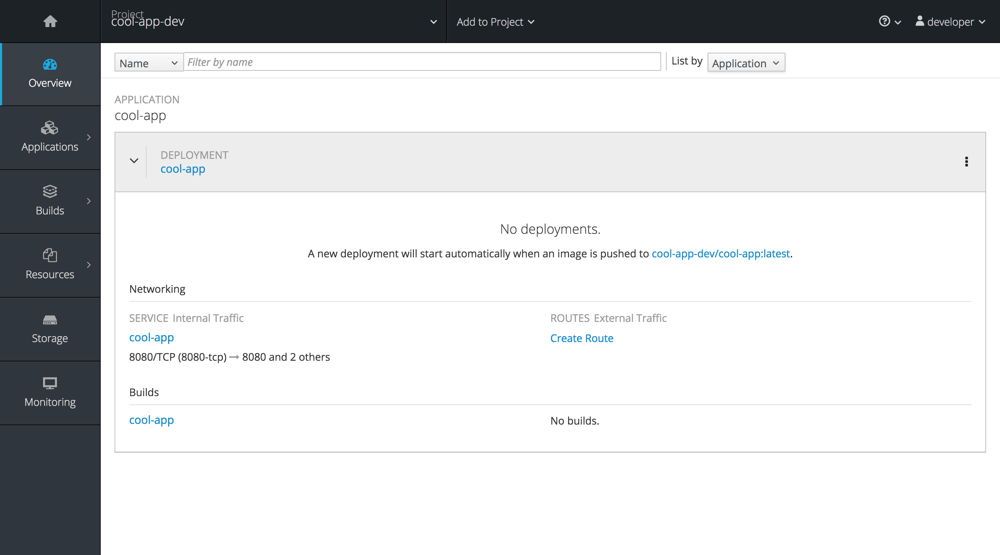
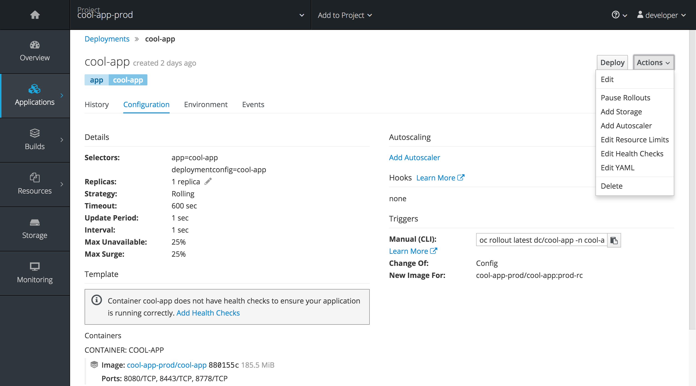
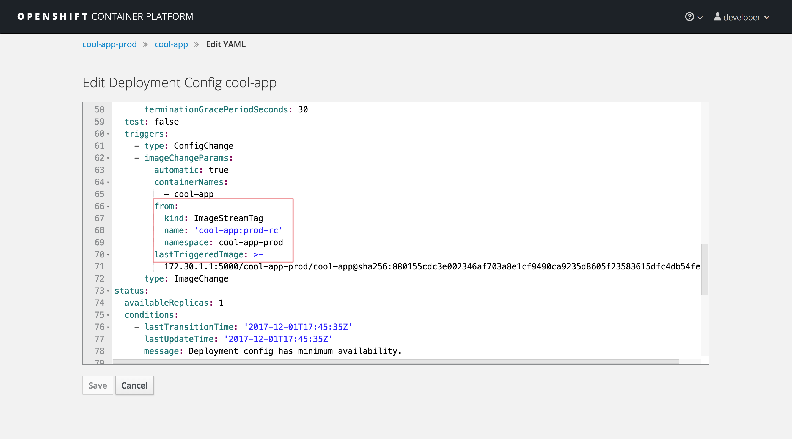
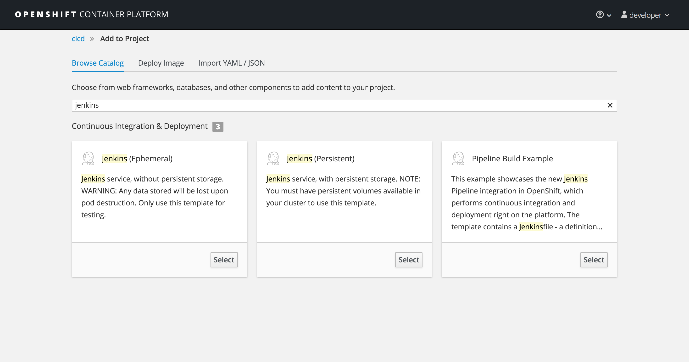
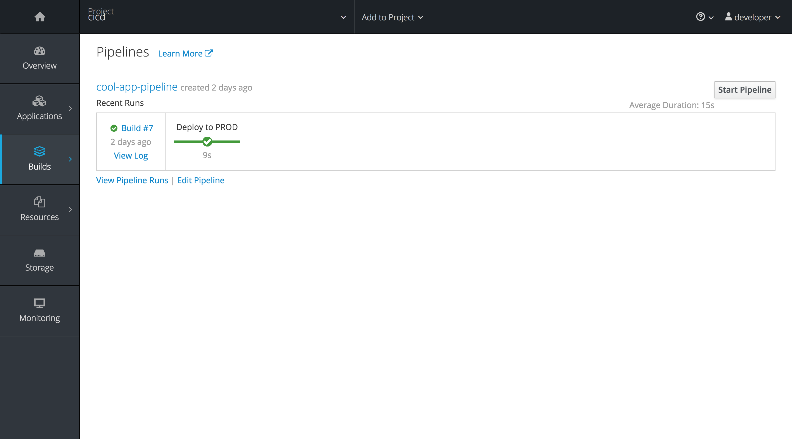

# Setup OCP

This example works both on openshift and minishift.

## Create the projects

* cicd
* cool-app-dev
* cool-app-prod

### cool-app-dev

create the project

Then:

```
$ mkdir /tmp/nocontent
$ oc new-app --name=cool-app jboss-webserver30-tomcat8-openshift~/tmp/nocontent
```

**Note**: you have to create the *dummy dir* ```/tmp/nocontent```

You should see this from the web console:



We can now start the binary deploy (build the cool-app with maven from the web-app dir):

```
$ oc start-build cool-app --from-file=<PATH_TO>/ROOT.war
```

Create the route:

```
$ oc expose svc/cool-app
```

### cool-app-prod

For prod we repeat the steps we did for *cool-app-dev* but:

* Add the app to project
* Deploy the binary warfile
* Expose the service 

After we tested that everything is ok we can delete the ```BuildConfig```, we left only the ```Deploymentconfig``` because we will use the pipelines to promote the images.

To delete the ```BuildConfig``` run:

```
$ oc delete bc cool-app
buildconfig "cool-app" deleted
```

Now we need to edit the ```Deploymentconfig```

Got to the web console in the deployment and choose ```Edit Yaml```



Find:

```
[...]
        from:
          kind: ImageStreamTag
          name: 'cool-app:latest'
          namespace: cool-app-prod
[...]
```

And change to:

```
[...]
        from:
          kind: ImageStreamTag
          name: 'cool-app:prod-rc'
          namespace: cool-app-prod
[...]      
```
It should looks like this:



## CICD with jenkins

First add jenkins to the project (from the webconsole):



Then go to cli and switch to the project:

```
oc project cicd
```

Grant all the roles to jenkins service account for the other two projects (cool-app-dev and cool-app-prod):

system:serviceaccount:cicd:jenkins

```
$ oc policy add-role-to-user edit system:serviceaccount:cicd:jenkins -n cool-app-dev
$ oc policy add-role-to-user edit system:serviceaccount:cicd:jenkins -n cool-app-prod
```

Add the pipeline to the project

```
$ oc create -f pipeline-release-sample.yaml
```

Now from the cicd project we can start the pipeline to promote our build from dev to prod:

